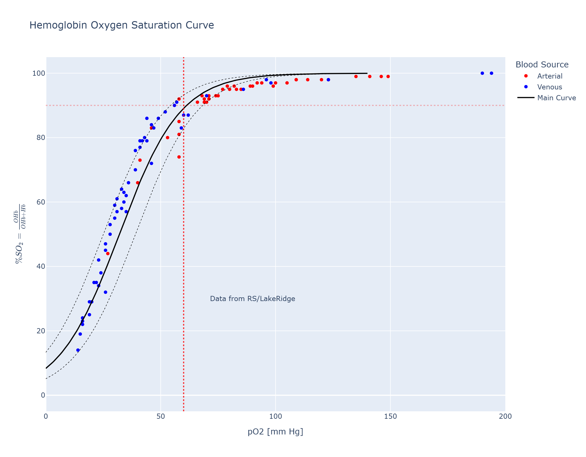
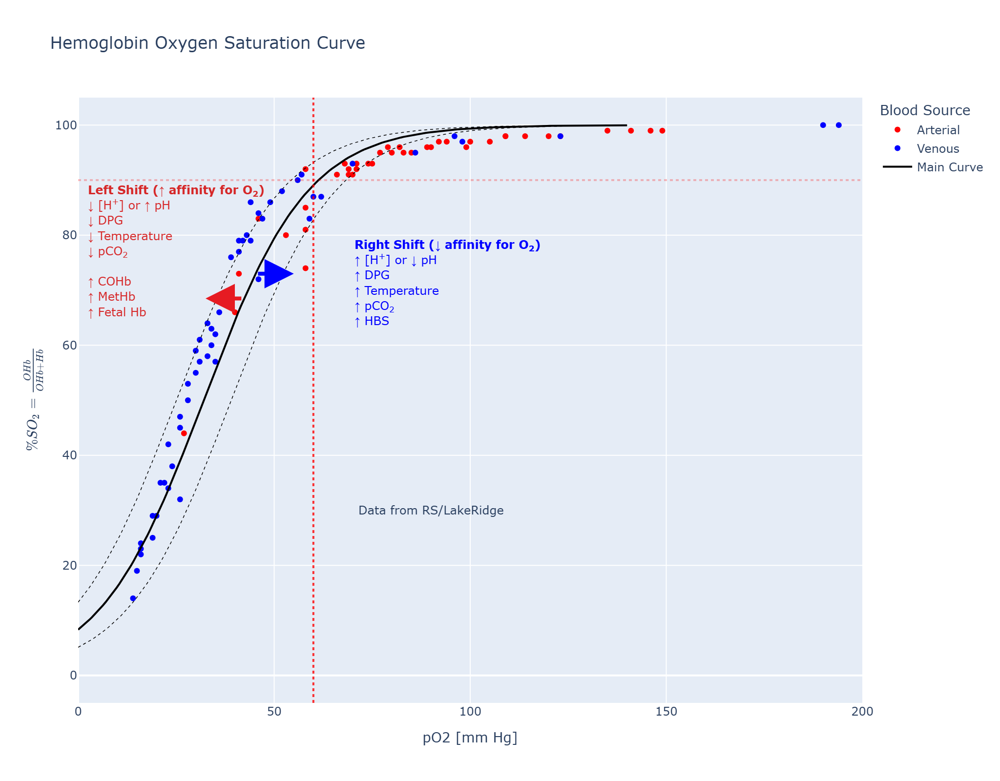
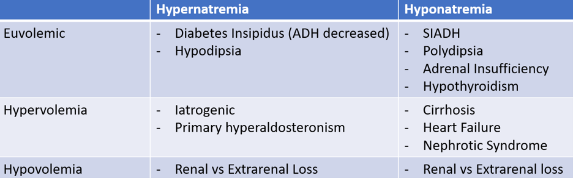
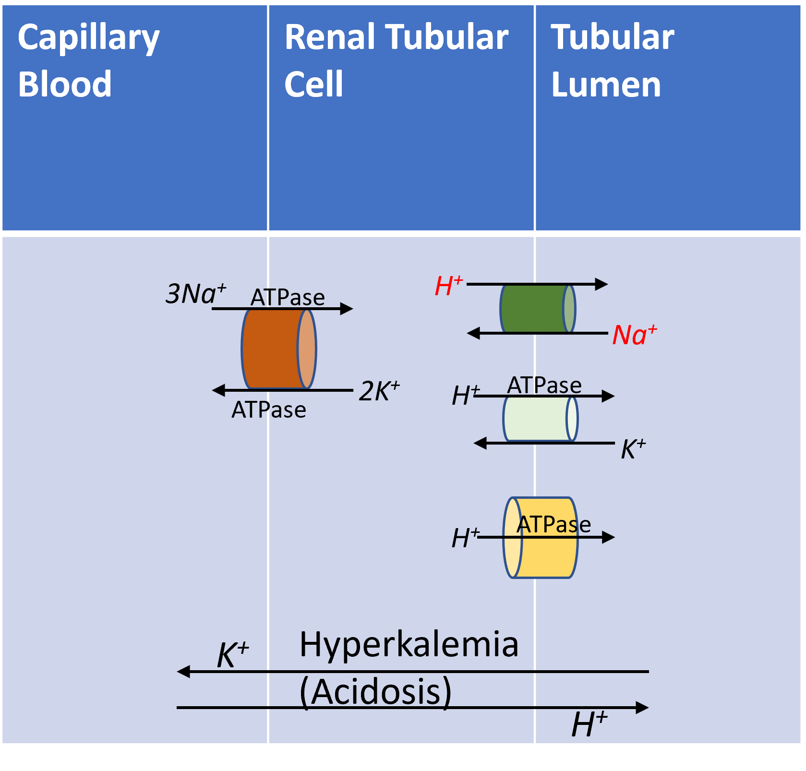
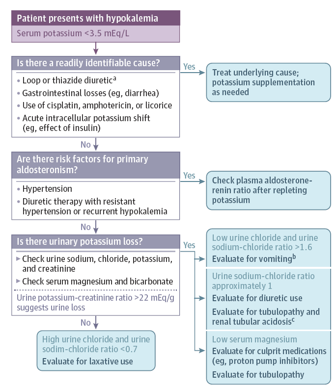
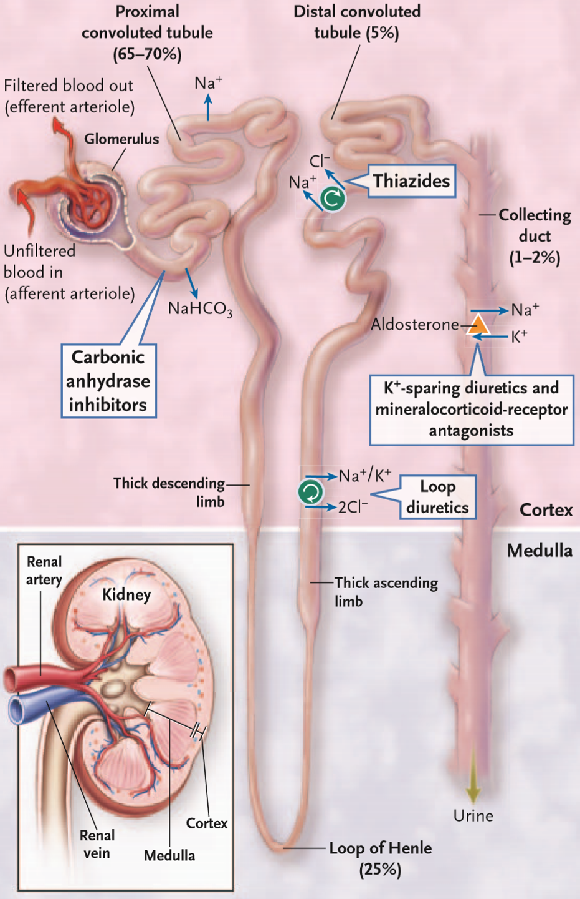

# Essential Questions in Blood Gases, Electrolytes Disorders & Acid-Base Balance

> **Rajeevan Selvaratnam, PhD, NRCC, DABCC, FCACB, FAACC
Clinical Biochemist - University Health Network
Assistant Professor - University of Toronto**

>Tutorial for Clinical Chemistry Fellows
June 23, 2026; 11:00 – 13:00h
> 

## Preamble

This book is written based on a culmination of questions from myself, students, trainees, and colleagues. The purpose of this question based approach is to enable students and trainees to evaluate their own understanding and grasp of materials.

Note: If you’re using the PDF version of this book, it will not be updated frequently or be current as the online version.

---

## Reference Intervals

A quick note about reference intervals. You should have a decent idea of the reference intervals for electrolytes and blood gases, which would be useful also for acid/bases problems (not covered here). For example, if I told you that we had a case of a patient with pCO₂ of 55 mm Hg from an arterial blood gas, you should be able to appreciate that such a level is relatively high or indicative of hypercapnia. Below are a set of reference intervals that one can use as a guide. Keep mind that reference intervals can vary due to instruments, demographics, blood source and other factors.

| Analyte           | Arterial Blood                                           | Venous Blood                                             | Units  |
| :---------------- | :------------------------------------------------------- | :------------------------------------------------------- | :----- |
| pO₂              | 80 - 100                                                 | 30 - 50                                                  | mm Hg  |
| pH                | 7.35 - 7.45                                              | 7.31 - 7.41                                              |        |
| ionized Calcium   | 1.12 - 1.32                                              | 1.12 - 1.32                                              | mmol/L |
| O₂ Saturation    | 95 - 99                                                  | 60 - 85                                                  | %      |
| pCO₂             | 35 - 45                                                  | 40 - 52                                                  | mm Hg  |
| BE Calculated     | 0 ± 2                                                   | 1 ± 2                                                   | mmol/L |
| HCO₃⁻           | 23 - 28                                                  | 22 - 28                                                  | mmol/L |
| Hemoglobin        | M: 140 - 180` `F: 120 - 160                         | M: 140 - 180` `F: 120 - 160                         | g/L    |
| Methemoglobin     | <2                                                       | <2                                                       | %      |
| Carboxyhemoglobin | Non-Smoker: <2` `Smoker: <9` `Toxic Range: >20 | Non-Smoker: <2` `Smoker: <9` `Toxic Range: >20 | %      |
| Glucose           | 3.8 - 7.7                                                | 3.8 - 7.7                                                | mmol/L |
| Lactate           | 0.5 - 1.5                                                | 0.5 - 2.2                                                | mmol/L |

---

## Preanalytical Errors & Considerations

 
   $\color{darkorange}{\textsf{What are some preanalytical errors or concerns with blood gas measurements? Try to list at least 5.}}$ 

1. Mislabelling
2. Air (bubble) in the sample. Ideally, anaerobic collection, *i.e.,* no exposure to air.
3. Appropriate volume requirement
4. Delay in analysis
5. Incorrect Transport and/or Storage
6. Insufficient Mixing (leads to clotted specimen)
7. Wrong collection containers
   * Concern here is insufficient heparin or dilution from liquid heparin
8. No arterial line flush, or insufficient removal of flush solution
9. Venous puncture during arterial sampling
   * Important to identify arterial *vs*. venous *vs.* mixed venous for some analytes (e.g. pO₂).

 
   $\color{darkorange}{\textsf{Does air exposure lead to decreased or increased pCO₂? Why?}}$

* CO₂ makes up 0.0407% of atmospheric air
* Therefore, using Dalton's Law, pCO₂ component of the air = 760 mm Hg X 0.0407% = $\textcolor{blue}{0.309\ mmHg}$
* pCO₂ in the arterial blood $\textcolor{red}{~40\ mmHg}$
* Thus **air leads to artificial $\textcolor{blue}{decrease\ in\ blood\ pCO₂}$** (movement of gas from area of high concentration (blood) to area of low concentration (*i.e.*, exposed air))
* pH will increase (blood pH is partially a function of pCO₂)

    $\color{darkorange}{\textsf{Does air exposure lead to decreased or increased pO₂? Why?}}$

* O₂ makes up 20.946% of atmospheric air
* pO₂ in the air = 760 mm Hg X 0.20946% = 159.19 mm Hg
* pO₂ in the arterial blood ~ 80 - 100 mm Hg
* pO₂ in the venous blood ~ 30 – 50 mm Hg
* **Air leads to artificial increase in blood** (movement of gas from area of high concentration (air) to area of low concentration (i.e., blood))
* pO₂ increases if initial pO₂ is less than that of ambient air (i.e. ~ 150 mmHg, 20kPa), and decreases if initial pO₂ is greater than that of ambient air (the latter case would only, of course, apply if the patient was receiving supplemental oxygen).

   $\color{darkorange}{\textsf{Why is insufficient blood volume collection (e.g. underfilling) a pre-analytical concern?}}$

1. Under-filling alters the intended Anticoagulant:Blood ratio
2. Syringes are electrolyte balanced for an expected volume
3. Prevent NSQ for analysis (NSQ = Not sufficient quantity)

   **Note:** While heparin is the anti-coagulant, heparin binds positively charged electrolytes (Na+ and iCa2+).

   $\color{darkorange}{\textsf{What would happen if blood gas analysis were delayed?}}$

1. Consumption of O₂ by cells; Red blood cells use little or no O₂, but white blood cells do consume O₂ [1,2].
   * $\color{green}{\textsf{What happens to pO₂ in myeloproliferative diseases with extreme leukocytosis/thrombocytosis (e.g. AML, Acute Myelogenous Leukemia)?}}$
     * Spuriously low pO₂ are possible, where the energy intensive WBC will consume O₂. So blood gas analysis should be done as soon as possible, especially in these patients.
2. Increased gas exchange (*i.e.* loss of O₂) through plastic walls [3].
   * Glass syringes preserve **pO₂** values better than plastic syringes (plastic syringes/containers are more common today, but have high oxygen permeability). Plastic syringes are used today because they are inexpensive, disposable, and not prone to breakage/shatter.
   * Generally, the gas loss through plastic tubes is insignificant, if performed <40 minutes [3].
   * Glass and plastic syringes are ~equivalent for pH and pCO₂.

*References:*

1. Kelman, G.; Nunn, J. Journal of Applied Physiology 1966, 21, 1484–1490.
2. Severinghaus, J. W.; Astrup, P. B. Journal of clinical monitoring 1986, 2, 174–189.
3. Zavorsky, G. S.; Wijk, X. M. R. van. Clin. Chem. Lab. Med. 2023, 1–10.

    $\color{darkorange}{\textsf{Should samples be transported on ice? Or room temperature?}}$

* Ice increases oxygen permeability in plastic tubes, leading to artificial increase in pO2.

  * Specifically, increase in $pO_2$ from exchange with air outside and decreased cellular metabolism
  * Verify your exchange rate for your tubes and various samples or scenarios as significant or not
  * 👍 **Ideal Practice:**
    * Ice  can harm $pO_2$ stability, measure samples stored at room temp.
    * Recent study: < 40 minutes at room temperature
      * (Reference: [https://doi.org/10.1515/cclm-2022-1085](https://doi.org/10.1515/cclm-2022-1085))
* Potassium is also subject to increase with prolonged (>1 hour) storage/transport on ice [1]

  Why?

  * Lowered temperatures inhibits red blood cells glycolysis, leading to decreased ATP production, which slows down the $Na^+/K^+$ ATPase pump that keeps the $K^+$ inside the cells. This leads to a “leaky” situation, (*i.e.* redistribution) , where more $K^+$ shifts from the intracellular fluid compartment to the extracellular fluid (plasma) compartment, thus increasing plasma $K^+$ [1].

*References:*

1. Zavorsky, G. S.; Wijk, X. M. van; Gasparyan, S.; Stollenwerk, N. S.; Brooks, R. A. The Journal of Applied Laboratory Medicine 2022, 7, 541–554.

<strong>
   $\color{darkorange}{\textsf{Can you use a pneumatic transport system (PTS) to transfer the blood gas specimens to the central or core laboratory?}}$
</strong>

* Depends on the stability of the pneumatic transport system (PTS).
* In some cases, experience and data suggests most PTS show no significant effect on pH and pCO2 [1]. However, pO2 can be affected if the sample is contaminated with even tiny amounts of air.
* You will need to verify your own settings and continuously monitor for changes to showcase that equivalent and consistent results can be obtained by transport via PTS.

*References:*

1. Pupek, A.; Matthewson, B.; Whitman, E.; Fullarton, R.; Chen, Y. Clinical Chemistry and Laboratory Medicine (CCLM) 2017, 55, 1537–1544.

   $\color{darkorange}{\textsf{Can vacutainers (evacuated tubes) be of use in blood gas measurements?}}$

* Not for pO2 or Oxygen saturation. General consensus and guidances from Clinical Laboratory Standards Institute recommend arterial blood gas samples be collected in syringes directly.
* For venous samples, evacuated tubes can potentially be used for pCO2, pH and other measurands, if you have data to support sufficiently equivalent results can be obtained. However, evacuated tubes are not completely vacuum; there is small amount of gas or residual air that can contaminate the results. Under-filled vacutainers create headspace or a void above the solution, enabling an equilibration between solution and gas phase, which also underlies the error[1].
* There is varying practices on the use evacuated tubes (vacutainers). However, data suggests vacutainers can lead to falsely high pH, pO2, and falsely low pCO2 [1].

*References:*

1. Tang, N.-Y.; Leanse, J. H.; Tesic, V.; Wijk, X. M. van. Clinica Chimica Acta 2020, 510, 671–674.

   $\color{darkorange}{\textsf{Why are clotted specimens rejected?}}$

1. Specimen was likely not handled according to standard process
2. Old/Aged specimen
3. Clogs analyzer
4. Clotting can have effects leading to measurement error
   $\color{darkorange}{\textsf{Are results reliable from clotted specimens?}}$
   * No. Filters or “clot catchers” are useful and help to reduce analysis of clotted specimens, but do not completely eliminate all clotted specimens. And some instruments have built in clot detection [1].

*References:*

1. D’Orazio, P. Point Care 2011, 10, 186–188.

---

## Oximetry and Co-Oximetry

$\color{darkorange}{\textsf{What is Oximetry or Co-oximetry?}}$

* Spectrophotometric assessment of Hemoglobin (Hb) content. In other words, an indirect assessment of pO2 (given by the Hemoglobin-Oxygen Dissociation (HOD) curve)

$\color{darkorange}{\textsf{What is the HOD curve? What is on the x- and y-axis? Why the sigmoidal curve?}}$

   * The x-axis contains the partial pressure of Oxygen.  

   * Saturation is on the y-axis,which is looking simply at the ratio of oxygenated hemoglobin to the sum of all hemoglobin species (oxygenated + deoxygenated). The curve is modelled as sigmoidal, but the sigmoidal nature is hard to appreciate in the real world figure illustrated here. See subsequent question and figure for that.  

   > **Important points to note:** 
      * Once arterial pO2 reaches ~60 mm Hg (red line in the figure), the curve begins to plateau (~getting nearly flat) indicating much lower levels of change in saturation above this point.
      * Thus, arterial pO2 ≥ 60 mm Hg is usually considered adequate.
      * But at < 60 mm Hg, the curve is very steep and small changes in arterial pO2 lead to greater reductions %saturation.

* The sigmoidal nature is due to the fundamental property of allostery & cooperativity underlying hemoglobin binding affinity for oxygen.

  

$\color{darkorange}{\textsf{What are factors that influence the HOD Curve? In other words, what factors can cause a left shift or right shift?}}$

  

The figure illustrates that following factors can cause a right shift.

* Increase in Temperature (e.g. fever)

* Increase in $[H^+]$ (or increase in acidic conditions, i.e. a decrease in pH)

* Increase in $pCO_2$ (recall that $CO_2$ is an acidic, which also decreases pH, thus leading to right shift).  Elevated $pCO_2$ can suggest respiratory acidosis

* Increases in 2,3 Diphosphoglyceric Acid (DPG) 

* Other factors as such increases in Hemoglobin S (HBS)  

The factors that cause a left shift are those such as: 

* Decrease in Temperature

* Decrease in $[H^+]$ (*i.e.* deprotonation or loss of acid -> a increase in pH)

* Decrease in $pCO_2$

* Decreases in (DPG) 

* Other factors: Increases carboxyhemoglobin, methemoglobin, or fetal hemoglobin

$\color{darkorange}{\textsf{What are 3 ways to measure saturated oxygen (SO₂)?}}$

1. Pulse Oximetry

2. Co-oximetry

3. estimated Oxygen Saturation (eO2 Sat)

$\color{darkorange}{\textsf{What is Pulse Oximetry (Pulse Ox)?}}$

* The pulse oximeter estimates the oxygen saturation transcutatenously.  By shining light (red and infrared light) at the fingertip or ear lobe and detecting appropriate signal absorption pattern, oximetric parameters are obtained that are related (and calibrated) to measurements of arterial blood oxygen saturation[1].  

* This method of assessing oxygen saturation makes several assumptions, what these assumptions are will be asked and discussed subsequently.

*Reference:*  

1. Keller MD, Harrison-Smith B, Patil C, Arefin MS. Skin colour affects the accuracy of medical oxygen sensors. Nature [Internet]. 2022 Oct;610(7932):449–51. Available from: https://www.nature.com/articles/d41586-022-03161-1

$\color{darkorange}{\textsf{When is pulse oximetry NOT appropriate?}}$

* If there are suspected dyshemoglobins, do not use pulse ox to measure SO2.

   * E.g. a comatosed patients with 15% COHb and by pulse oximetry SO2 ~95% can be achieved, which is inaccurate  

$\color{darkorange}{\textsf{How do you determine Oxygen Saturation with Co-Ox?}}$

- Co-Ox determination of $SO_2$, denoted as $F_{O_2Hb}$, i.e., Fraction of Oxyhemoglobin has RI of 90 - 95% .

* Ratio of $[O_2Hb]:\sum[All Hb Forms] = FO_2Hb$ 

* $$F_{O_2Hb} = \frac{[O_2Hb]}{[O_2Hb]+[HHb]+[CoHb]+[MetHb]+[SulHb]}$$ 

$\color{darkorange}{\textsf{How do you determined estimated O₂ saturation, eO₂Sat?}}$

- *e* is for estimated.  Any one of a number of complex algorithms that have been developed for calculation of sO2(a) from measured pO2(a)
> What assumptions are made?
   1. Assumes normal temperature
   2. Normal affinity of hemoglobin
   3. Normal [DPG]
   4. Absence of dyshemoglobins
   - Calculations of sO2(a) from measured pO2(a) all attempt to take account of some of the variables outlined above that affect the HOD curve.

   - Keep in mind: These algorithms require input of not only of measured pO2(a) but also measured pH and in some cases measured pCO2(a) or calculated base excess.

---

## $pO_2$

$\color{darkorange}{\textsf{Why measure pO₂?}}$

1. Assess the ability to deliver oxygen to tissue
2. Diagnosis respiratory failure
3. Monitor $O_2$ therapy

* Low $pO_2$ = hypoxemia (< 60 mm Hg)
   * Consider hypoxemia vs hypoxia 
      * What is hypoxia?
         * Low oxygen content in any tissue, organ, or whole body; 
                        - Due to defective delivery or defective Utilization  
* $pO_2$ ~60 mM Hg lower in venous blood after release to capillaries  

>[!info] Arterial Collection
   **$pO_2$** measurements are the main reason for arterial collection

$\color{darkorange}{\textsf{What are 3 variables affecting Total Oxygen Content in blood?}}$

Total arterial oxygen content ($CaO_2$) $ = FO_2Hb \times \beta O_2 \times [total\ Hb]) + \alpha' O_2 \times pO_2$ 

* where $\beta O_2$ is the oxygen binding capacity = 1.39 mL $O_2$ /g Hb.
* Where $\alpha'$ is the solubility coefficient of oxygen in blood = 0.00314 mL/dL/mm Hg  

>[!info] The three variables are: 
   1. Fraction of Oxyhemoglobin(*i.e*., **saturation or saturability**),
   2. Hemoglobin Concentration*, (*i.e*., **binding capacity**) and 
   3. **$pO_2$** (*i.e* **supply**)

>[!warning] Other Variables
   We discussed above in the Hemoglobin-Oxygen Dissociation curve, variables that affect the affinity for binding of Hb. These secondary variables don't necessarily change the structural capacity of the blood, but they drastically alter hemoglobin's affinity for oxygen.  This also structural interferences (dyshemoglobins)

## $pCO_2$
$pCO_2$ is ~2 - 8 mM Hg higher in venous blood

$\color{darkorange}{\textsf{Why measure pCO₂?}}$

   1. Monitoring Acid/base status ($pCO_2$, reflects respiratory contribution)

   2. Distinguish Type 1 & 2 respiratory failure (need arterial pO2 & arterial pCO2)
      > **Type 1:**  $pO_2 <60$ mm Hg (Hypoxemia) **+** normal or reduced $pCO_2$
      >  Causes of type 1 respiratory failure include:
            - Pulmonary edema
            - Pneumonia
            - ARDS (fluid leakage into lungs)
            - COPD
            - Asthma
            - Chronic pulmonary fibrosis
            - Pneumothorax (air in the (pleural) cavity between lungs and chest wall)
            - Pulmonary embolism
            - Pulmonary hypertension

      > **Type 2:** $pO_2$ <60 mm Hg (Hypoxemia) + $pCO_2$ ****>50 mm Hg ****(Hypercapnia)
         > * Commonly caused by, **COPD**, but may also be caused by:
            1. Chest-wall deformities
            2. CNS depression (associated with reduced respiratory drive)
               - e.g. Sedatives and strong opioids
            3. Neuromuscular disease 
               - Myasthenia gravis
               - Muscle disorders
               - Respiratory muscle weakness
            4. Severe asthma
   3. Monitor safety/efficacy of $O_2$ therapy or mechanical ventilation

$\color{darkorange}{\textsf{Hyperventilation leads to increase or decrease in pCO₂?}}$

**↓** $_pCO_2$  blows off more $_pCO_2$

$\color{darkorange}{\textsf{Hypoventilation leads to increase or decrease in pCO₂?}}$

↑ $_pCO_2$, causes Hypercapnia

---

## Agents that cause cellular hypoxia

1. CO
2. Methemoglobin-forming agents
3. Cyanide

### Carbon Monoxide Poisoning

$\color{darkorange}{\textsf{What is it CO Poisoning?}}$

- Carbon monoxide (CO) at low concentrations is an odorless and colorless gas
- **Small amounts produced during metabolism (heme → biliverdin conversion)**
   - Endogenous CO formation during normal metabolism leads to a **background carboxyhemoglobin (COHb) concentration of about 0.5-0.8%**.
   - Smokers are exposed to considerable CO concentrations leading to an average COHb of 4%, with a usual range of 3-8%
   - **What are other reasons for increased CO?**
      - Increased destruction of red blood cells. For example, caused by **hematomas, blood transfusion, or intravascular hemolysis and accelerated breakdown of other heme proteins** will lead to increased production of CO.
            - In patients with **hemolytic anemia**, the CO production rate is 2-8 times higher; consequently blood COHb is 2-3 times higher than in healthy individuals
   
>[!info] COHb ranges
Normal findings for saturation of hemoglobin differ among smokers, nonsmokers, and newborns:
>   - Adults: <2.3% ; < 3% saturation of total hemoglobin
>  - Smokers: 2.1% - 4.2%
>  - Heavy smokers (>2 packs/day): 8% - 9%
>  - Hemolytic anemia: Up to 4%
>  - Newborns: ≥ 10 - 12%
>  - Critical Values: >20%

$\color{darkorange}{\textsf{What is the pathophysiology of CO Poisoning?}}$

- **Allosterically induces tighter** $O_2$ **binding; Affects the release of O2**  

   - Reduced oxygen-carrying capacity of the blood
   - Affinity is 230–300X that of $O_2$,
      - Bind heme Fe2+ of Hb to form carboxyhemoglobin
      
> **∴ High [COHb] limit the oxygen content of blood by slow release rate of** $O_2$ **→ hypoxia**
            
   - CO also interferes with peripheral oxygen utilization.
      * CO can also **bind other heme proteins such as myoglobin and cytochrome oxidase** limiting overall oxygen use
- Patients with coronary artery disease show health effects at lower COHb concentrations (than children, pregnant women, or healthy adults)

$\color{darkorange}{\textsf{What are the Symptoms of Poisonings?}}$

   - Range from dizziness, headache, unconsciousness to death.
   - The toxic effects of CO are a result of hypoxia
   - Tissue damage results from local hypoxia. Organs with a high oxygen requirement, (heart & brain), are especially sensitive
   - AEGL (Acute Exposure Guideline Levels) for Hazardous Substances
      - See: [https://www.epa.gov/aegl](https://www.epa.gov/aegl)
      - 40% COHb concentration seems to be a reasonable threshold for lethality

$\color{darkorange}{\textsf{What is the treatment for CO poisoning?**}}$

- The initiation of 100% oxygen breathing as early as possible
- Hyperbaric oxygen therapy

$\color{darkorange}{\textsf{How does CO Poisoning effect the HOD curve?}}$

- **Leftward shift** in the position of the oxyhemoglobin dissociation curve
   - High affinity for O2 induced and slow off-rate of O2
      - [https://www.ncbi.nlm.nih.gov/books/NBK539815/](https://www.ncbi.nlm.nih.gov/books/NBK539815/)

$\color{darkorange}{\textsf{What is the impact of delayed COHb measurement?}}$

- CO has a short half-life.
   **- False negative or impression of low CO exposure** if delay b/w patient removal from exposure and blood sampling
   - Half-life of COHb ~ 3-4hrs when room air is inspired (30 - 90 minutes if 100% O2 is inspired)
   * **Normal COHb might not be sufficient to exclude diagnosis of CO poisoning if delay in blood sampling**

$\color{darkorange}{\textsf{What is the impact of CO on pulse oximetry based SO₂ and calculated  eSO₂?}}$

- Oxygen Saturation (SO2) will be normal by pulse Ox.
- estimated O2 Saturation will also be normal

$\color{darkorange}{\textsf{What is the impact of CO on pO2?}}$

- $pO_2$ is Unaffected by CO poisoning;
   - Total $ctO_2$ is reduced (where ct = concentration of total of dissolved in solution and undissolved), but the measured pO2 (dissolved $O_2$) appears normal
   - In contrast, hemoglobin-bound $O_2$ (typically ~92% - 95% arterial $O_2$ content) is profoundly reduced in the presence of COHb.

$\color{darkorange}{\textsf{What other tests are evaluated in patient with CO poisoning?}}$

>1. Severe cases ECG obtained and biomarkers for cardiac ischemia measured
>2. Lactate measurements can indicate hypoxia
>3. Electrolytes (if not included already with Blood gas measurements)
>4. CK

>[!warning] Note: Patient symptoms and signs guide management, not carboxyhemoglobin levels

$\color{darkorange}{\textsf{What Methods are used to measure CO?}}$

- **GC**
   - Relatively accurate and precise even for at lower concentrations
   - Reference procedure
- **Indirectly as carboxyhemoglobin by spectrophotometry**
   - Typically comparable to GC >3%; i.e. sufficient to detect exogenous CO.
      - Inadequate to detect endogenous production of CO from hemolytic anemia
      - Falsely high CO (4- 7 %) may occur when blood from neonates is measured by some spectrophotometric using fewer wavelengths
      - Erroneous result in **lipemic** or **icteric** specimens
      - Erroneous results in methylene blue - not treatment for CO

>[!info] Venous samples are okay for use to determine COHb level, but they are less accurate in quantifying the associated acidosis.
>- Useful for screening large numbers of potential CO victims in disaster situations and for monitoring changes over time during treatment.

## Methemoglobinemia
Normal methemoglobin is <1.5% of total Hb

$\color{darkorange}{\textsf{Why or how does it happen?}}$

- **Heme iron in Hb is normally in ferrous state (**$Fe^{2+}$**);** oxidation to Ferric state ($Fe^{3+}$) = metHb = no binding to $O_2$ = hypoxia symptoms
>[!info] Ferric state results in allosteric changes that shifts the oxygen-dissociation curve to the left. 
>This shift leads to increased affinity of the ferrous iron for oxygen **and thus impaired oxygen release to the tissue**

$\color{darkorange}{\textsf{What are Causes of MetHb?}}$

- **Acquired**:
   1. Caused by various drugs and chemicals (oxides of nitrogen, other oxidant combustion products make smoke inhalation)
      1. Drugs include for example dapsone or rasburicase
- **Genetic(Congenital)**:
   1. *NADH-MetHb reductase deficiency also called* Cytochrome b5 reductase (CYB5R)
      - Enzyme responsible for reducing Hb
      - A deficiency of CYB5R in erythrocytes is an autosomal recessive disorder resulting from variants in the *CYB5R3* or the *CYB5A* genes.
   2. HbM
      - Caused by a various mutations in the α-, β-, and γ-globin genes
            - Ref: [https://doi.org/10.1016/B978-0-323-53045-3.00033-7](https://doi.org/10.1016/B978-0-323-53045-3.00033-7))
      - Hb that is more susceptible to oxidation & resistant to reduction

 

 

$\color{darkorange}{\textsf{What are Symptoms?}}$
 

- Cutaneous discoloration (gray), cyanosis, chocolate-brown blood
   - Symptom severity dependent on **[metHb]** and consequent to hypoxia (diminished O2)
      - [metHb] >20% → dyspnea, fatigue, weakness, and syncope
      - [metHb] >50% → dysrhythmias, seizures, metabolic acidosis and coma
      - [metHb] > 70% → lethal

$\color{darkorange}{\textsf{What is the treatment?}}$

- Specific therapy = methylene blue (act as an electron transfer agent)
- Methylene blue and sulf-Hb causes spectral interference

$\color{darkorange}{\textsf{What can be expected from pulse Oximetry and pO2 measurements?}}$

- **Pulse Ox maybe falsely normal or borderline normal**
   - MetHb interferes with non-invasive pulse Ox
- **The pO2 is normal in these patients and therefore calculated/estimated  $O_2$ Saturation is also falsely normal (FN)**
   - Normal pO2 in a cyanotic patient = possible presence of methemoglobinemia
   - Co-Ox based $O_2$ Saturation will be lower than that measured by pulse Oximeter
      - eO2Sat may remain normal
   - MetHb not stable at room temp; kept on ice, not frozen
      1. Freezing results in increase [metHb]

### Case Study

- A cyanotic patient with oxygen saturations between 85% to 90% should have co-oximetry analysis performed.
    
    See: [DOI:10.1056/NEJMicm1816026 (Otis et al., 2019 n engl j med 381;12)]( 
    https://universityhealthnetwork-my.sharepoint.com/:b:/g/personal/rajeevan_selvaratnam_uhn_ca/IQAdMnQx7E5KR7YimzxIEZLaAeSPEFCBjjo0glE7BYThjXA?email=Rajeevan.Selvaratnam%40uhn.ca&e=qhfUL2)

## Cyanide

$\color{darkorange}{\textsf{What is it?}}$

- Chemical compound that contains the group C≡N
- Binds to heme $Fe^{3+}$ of cytochrome oxidase

>[!info] Examples of Exposures:
> * Iatrogenic cyanide poisoning during use of nitroprusside (used to treat blood pressure, *i.e*. a hypotensive agent)
> * Most common source of CN poisoning in humans arise smoke inhalation from exposure to fires 
   
   - **Bonus**: What is the mechanism of toxicity?
      
      * Arrests aerobic cell metabolism. Cyanide reversibly binds to the ferric ions cytochrome oxidase 3 within the mitochondria - halts cellular respiration by blocking the reduction of oxygen to water. Ultimately leads to **histotoxic hypoxia**
      
      - See [https://www.ncbi.nlm.nih.gov/books/NBK507796/](https://www.ncbi.nlm.nih.gov/books/NBK507796/)

>[!IMPORTANT] Cyanide exposure correlates well with serum lactate levels.
> Because cyanide inhibits cytochrome oxidase in the mitochondrial electron chain, cells are forced into anaerobic metabolism, resulting in profound lactic acidosis

>[!CAUTION] Often overlooked and treatment is complicated by the potential coexistence of COHb and methemoglobinemia

$\color{darkorange}{\textsf{What are the symptoms?}}$

- Symptoms typical of hypoxia
   - Crosses all biological membranes
   - Cellular hypoxia symptoms:
      - Headache, flushing, tachypnea, dizziness, respiratory depression → progression to coma, seizures, heart block and death

$\color{darkorange}{\textsf{What is the treatment?}}$

* **Antidote = hydroxycobalamin** → given without lab testing if suspected for CN poisoning

>[!info] Hydroxocobalamin =  vitamin B12A.
> * complexes with cyanide, on a mole-for-mole ratio to form cyanocobalamin.
> * Hydroxocobalamin is a strong red chromophore.

>[!tip] Interference with co-oximetric and colorimetric laboratory measurements has been reported

$\color{darkorange}{\textsf{How is CN measured?}}$

>[!TIP] Thiocyanate (SCN), is the principle metabolic product of cyanide metabolism.
* **UHN Method:** Thiocyanate in a protein-free serum filtrate (accomplished using Trichloroacetic acid) reacts with ferric ions to form ferric thiocyanate, an unstable red compound. The intensity of this color is measured at spectrophotometrically.

**Why measure SCN and not CN?** 

* 💡 CN is an unstable molecule and has an elimination half-life of 1 hour in blood in vivo. Therefore determination of CN in blood requires rapid sampling and analysis.  

* Alternatively one can simply measure thiocynate (SCN), which can last upto 7 days (assuming normal kidney function)

* The body detoxifies cyanide using liver enzyme, called rhodanese, which takes a sulfur atom (usually from thiosulfate) and attaches it to the cyanide molecule, converting it into thiocyanate. 

$\color{darkorange}{\textsf{Where else would SCN be elevated?}}$

1. Tobacco smokers (HCN ingestion)
2. Treatment with Sodium nitroprusside for cardiovascular conditions
- **Details:**
   - After prolonged administration thiocyanate may accumulate, causing nausea, vomiting, sweating, palpitations and acute toxic psychosis.
   - Toxicity occurs at plasma concentrations > 1.7 mmol/L.  Excessive concentrations may also interfere with thyroid function.
      - The toxicity of nitroprusside is derived from the reaction of the ferrous ion in the nitroprusside with sulfhydryl-containing compounds in the red blood cell.
            - Cyanide is produced and then subsequently reduced to thiocyanate in the liver.  Thiocyanate is excreted in the urine with a half-life (t1/2) of 3-4 days.
   - Plasma thiocyanate levels should be monitored closely on patients with renal impairment.  Recall that elimination is through the kidney.

   ---

# Disorders of Sodium Homeostasis

- Excessive loss, gain, or retention of $Na^+$
- Excessive loss, gain, or retention of $H_2O$

## Hyponatremia: decreased plasma Na+, <135 mmol/L

$\color{darkorange}{\textsf{What are the symptoms?}}$

- Symptoms are due to changes in osmolality
   - Nausea/headache
   - Generalized weakness
   - Mental confusion (<120 mmol/L)
   - Seizures

### Pseudo*hypon*atremia

$\color{darkorange}{\textsf{What is it? what are the consequences?}}$

* Method artifact by measurement (e.g. indirect ISE)
    * Volume displacement A.K.A Electrolyte Exclusion Effect (from high protein and/or lipid content)

   - Affects indirect ISE.
      - **Uses diluent of fixed ionic strength of the plasma AND Assumes plasma water volume is ~93%**
      - Not true with hyperlipidemia or hyperproteinemia (e.g. multiple myeloma)
         - PseudohypoNatremia or PseudohypoKalemia is possible
      - **Note:** Some analyzers with direct ISE operate in “flame mode” to align with indirect ISE (i.e. correction by multiplying 0.93)

$\color{darkorange}{\textsf{What is the differential of hyponatremia?}}$

    
>[!tip] Always consider the plasma osmolality to answer this question and then consider the volemias.

**Hypo-Osmotic (Decreased Plasma Osmolality)**

1. Hypovolemic Hyponatremia (Depletion)
2. Hypervolemic Hyponatremia (Dilution)
3. Euvolemic Hyponatremia (Delusion)

**Hyper-Osmotic (Increased Plasma Osmolality)**

1. Translocational Hyponatremia
   * Extracellular shift of water or Intracellular shift of Na+ to maintain  osmotic balance
   
$\textcolor{green}{Let's\ get\ into\ more\ detailed\ questions}$

### HyperOsmotic Hyponatremia 

$\color{darkorange}{\textsf{What is it?}}$

* Can think of it as **"Translocational Hyponatremia"**

    * Shift of water from cells (ICF) —> ECF driven by solutes confined in ECF (e.g. increased osmolytes such as glucose or urea in plasma)  
    * Consider high glucose, hyperglycemia
        1. **Hyperglycemic Hyperosmolar State (HHS), can lead to coma or death**
        2. HHS: severe hyperglycemia (Na+ decreased ~1.6 -2.4 mmol/L for every 5.6 mmol/L increase in glucose above 5.6 mmol/L)
        3. **Patients may be asymptomatic (until [Na+] < 120 mmol/L)**

### Euvolemic hyponatremia

$\color{darkorange}{\textsf{What are the causes?}}$

- **Primary Polydipsia: Excess $H_2O$ water consumption**
   - Seen in patients with hypothalamic lesions
   - Psychogenic polydipsia:
      - Excessive drinking in psychiatric patients
   - Polyuria (large volumes of urine production) maintains euvolemic state
- **Syndrome of inappropriate ADH (SIADH)**
   - Causes: Sustained ADH release
      - CNS based: Brain Tumor, infection (E.g. meningitis)
      - Drugs: anticonvulsants, antiparkinsonian, antipsychotics, antipyretics, antidepressants, ACE Inhibitors

**Remember SAD-PH as mnemonic**
    1. SIADH
    2. Adrenal Insufficiency
    3. Diuretics (e.g. K+ sparing diuretics such as spironolactone)
    4. Polydipsia
    5. Hypothyroidism

### Hypervolemic Hyponatremia

$\color{darkorange}{\textsf{What are causes?}}$

- **Dilutional Hyponatremia**  → **Fluid overload** (Hypervolemic water gain or retain;) scenarios where ECF is increased, blood volume is decreased
   1. Cirrhosis
   2. Heart failure
      1. CHF: Increased ECF, decreased (effective circulating) blood volume
   3. Nephrotic Syndrome → hypoalbuminemia
   4. Advanced Kidney Failure
      1. Excess water retention > sodium retention → (edema)

### Hypovolemic hyponatremia

$\color{darkorange}{\textsf{What are renal and non-renal causes?}}$
 

**Depletional Hyponatremia** 
* When hypovolemic, separate into Renal vs. Non-Renal
    * **Renal loss (if urine [Na+] > 20 mM)**
        1. Diuretics
        2. Nephropathies (PKD)
        3. Renal tubular acidosis
        4. Mineralocorticoid def.
        5. Ketonuria
    * **Extrarenal (Causes of Volume) loss (Urine [Na+ ]< 20 mM)**
        1. Vomiting, diarrhea

## Hypernatremia

$\color{darkorange}{\textsf{What are the causes?}}$

- Almost always hyperOsmolar
   - Break down into  3 cateogries
      1. Hypervolemic Hypernatremia
      2. Hypovolemic Hypernatremia
            1. Renal vs Non-Renal
      3. Euvolemic Hypernatremia

        

### Hypervolemic Hypernatremia

$\color{darkorange}{\textsf{What are causes?}}$

- Scenarios where there is increase in volume and $Na^+$
   1. Iatrogenic: Typically from administering **hyper**tonic solutions
   2. Primary hyperAldosteronism (Conn’s syndrome) from tumor or hyperplasia

### Hypovolemic Hypernatremia

$\color{darkorange}{\textsf{What are Renal vs Non-Renal causes?}}$

- More water loss than $Na^+$ sodium loss
   - Renal losses:
      - Renal disease or diuretics (Urine [Na+] > 20 mmol/L)
   - Extrarenal losses:
      - Sweat, stool, fluid shifts after burns or surgery

### Euvolemic Hypernatremia

$\color{darkorange}{\textsf{What are causes?}}$

1. Hypodipsia: decreased water intake (e.g. hypothalamic lesion)
2. Diabetes Insipidus
   - **What are the two types of DI?**
      1. Central DI
            - As in ADH deficiency is due to decreased secretion from the brain (*e.g.,* inhibition by tumor, post-neurosurgery gone wrong, or head trauma).
      2. Nephrogenic DI
            - Kidneys not able to provide the receptor for ADH to act on, or other downstream players that are non-functional.  This can be due to a variety of nephropathies including ADPKD, drug induced nephrotoxicity, or mutations of various proteins along the signalling cascade involving AVPR2 (**arginine vasopressin receptor 2)**.  For example, patients with nephrogenic DI are found to have mutations in aquarporin-2 or AVPR2.

### Sodium Disorder Summary

  

# Potassium

$\color{darkorange}{\textsf{Serum or Plasma Potassium Higher?}}$

* Serum
   - During coagulation (clotting), $K^+$ is released from platelets as they aggregate and degranulate

### Hyperkalemia

$\color{darkorange}{\textsf{What are symptoms of Hyperkalemia?}}$

- Muscle weakness/pain/cramps
- Nausea
- Chest pain/arrhythmia → cardiac arrest

$\color{darkorange}{\textsf{What are Preanalytical causes of HYPERkalemia?}}$

1. **Excessive fist clenching**
   - Release of K+ from muscle cells
2. **Prolonged tourniquet**
   - Leakage of intravascular fluid→ hemoConcentration + RBC lysis
3. **Traumatic or Improper venipuncture leading to hemolysis**
   1. Large-gauge (small bore diameter) needles
   2. Use of syringe and needle rather than evacuated tube collection systems
      (notably applying excessive force with syringe draws)
   3. Sampling blood via IV catheter
4. **Excessive vigorous tube inversion**
5. **Delayed separation and/or Improper specimen processing**
   1. Poor barrier formation in gel tubes
   2. **Chilling whole blood (i.e.) > 2hrs**
      - Inhibits Na/K Pump (normally pumps K+ into cells)
      - Familial pseudohyperkalemia - leaky red blood cell leading to increased K+ in ECF at room temperature
   3. Excessive centrifugation or recentrifugation

6. **Carry over from EDTA (Lavender) or K-Oxalate (grey-top) tubes** → improper order of draw
   - Pour over from EDTA tube or using K-Oxalate tube
7. **Incomplete clotting leading to Microfibrins that cause erroneous aspiration**
8. **IV line draw (Potassium containing IV fluids)**

*References*
1. [https://www.ncbi.nlm.nih.gov/pmc/articles/PMC4206178/](https://www.ncbi.nlm.nih.gov/pmc/articles/PMC4206178/)
2. Andolfo I, Russo R, Manna F et al. Functional characterization of novel ABCB6 mutations and their clinical implications in familial pseudohyperkalemia. Haematologica 2016; 101: 909-17.
3. Lukens M, deMare A, Kerbert-Dreteler M et al. Leaky cell syndrome: a rare cause of pseudohyperkalemia. Ann Clin Biochem 2012; 49: 97-100.

 

$\color{darkorange}{\textsf{What patient factors can underlie hyperkalemia?}}$

1. **Thrombocytosis (high platelets)**
   - Platelets release $K^+$ during clotting
      - pseudohyperkalemia when Serum K+ elevated and Plasma K+ is not.
            - Use and rely on plasma sample
2. **Leukocytosis**
   1. **Chronic Lymphocytic Leukemia, Acute Leukemia**
      - Reverse Pseudohyperkalemia notable; **plasma $K^+$  is elevated** and Serum $K^+$ is not.
      * Leukemic leukocytes are more fragile & susceptible to lysis 
         - **Increased sensitivity to heparin-mediated** cell membrane damage during processing and centrifugation
            - Compounded by pneumatic transport systems which induces additonal mechanical disruption/jostling to cells.
            
      > Use and rely on serum samples
   
   2. **Other reason for leukocytosis (other WBC neoplasmas)**
   
3. **Decreased urinary excretion** (See Kidney Didactic)
   1. Renal failure – decreased filtration, 
   2. Mineralocorticoid Def. → Hypoaldosteronism
      - Decrease [aldosterone] or decreased response to aldosterone
      - Aldosterone increases Na+ reabsorption in exchange for K+ and H+.
            
4. **Redistribution**
   1. Cellular breakdown (Pseudohyperkalemia – cell lysis)
      - Tumor lysis after chemotherapy
      - Crush injuries/trauma/massive tissue hypoxia
      - Hemolytic anemias/spherocytosis
         - **Hemolytic anemias = RBCs are destroyed faster than they’re produced**.
         - e.g of Hemolytic anemia is sickle cell disease (SCD) 
            - Renal failure is also a complication of SCD, and may affect excretion  
   2. Insulin deficiency/resistance
      - Insulin promotes dietary K+ into cells
   3. Metabolic Acidosis
      - RTA type 4
5. **Medications**:
   * **Beta‑blockers** reduce the effects of epinephrine (adrenaline).  They do this by blocking β‑adrenergic receptors on the heart and blood vessels. They also Block β‑receptors in the kidneys, this leads to:

      * ↓ renin release

      * ↓ RAAS activation

      * ↓ blood pressure
   * **Diuretics:**
      * K+ sparing diuretics (MR receptor antagonists): decrease pH
      Hyperkalemia --> Metabolic Acidosis
            
6. **Increased Intake of K+ (rare)**
7. **Blood transfusion**
8. **Familial Pseudohyperkalemia**
9. **Acid-Base Disturbance**
   

$\color{darkorange}{\textsf{Is HYPERkalemia associated with Acidosis or Alkalosis?}}$

  

Hyperkalemia is associated with acidosis.
**Hypokalemia** is associated with **alkalosis**.

### Hypokalemia: plasma [K+] < 3.5 mmol/L

$\color{darkorange}{\textsf{What are the symptoms?}}$

- Weakness.
- Fatigue.
- **Muscle cramps** or twitching.
- Constipation.
- Arrhythmia (abnormal heart rhythms)

$\color{darkorange}{\textsf{What are the Causes?}}$

- Most common cause are diuretics (e.g.thiazide causes) and GI loss
- Break it down into 3 categories
   1. **Increased urinary (renal) or GI loss**
      - Vomiting resulting in acid loss from stomach alkalosis
      - Renal loss:
         - hyperaldosteronism (e.g. adrenal adenomas)
         - RTA type 1 & 2
         - Diuretics
         - glucocorticoid xs
            
      - ExtraRenal Loss:
         - GI Loss: Vomiting or Diarrhea
            - Vomiting results in acid loss from stomach —> alkalosis
               - Recall Alkalosis and hypokalemia versus Acidosis and Hyperkalemia
         - Excessive sweating

   2. **Shift of K+ from ECF to ICF**
         1. Insulin excess (excess treatment with insulin or insulinoma)
         2. Pseudohypokalemia - increased WBC take up more ECF K+ due to prolonged storage; Rapid separation is necessary and avoid prolonged storage.
         3. Catecholamine Excess or Beta-Adrenergic excess (Epinephrine)

   3. **Decreased Intake (Rare)**

>[!tip] Additionally consider other algorithsm
> 1. Consider also use of Tietz Texbook Algorithm 
> 2. Consider also a recently published workup for hypokalemia in: JAMA 2021 Mar 23;325(12):1216-1217. doi: 10.1001/jama.2020.17672
>

>  
>

* Figure above is from: JAMA 2021 Mar 23;325(12):1216-1217. doi: 10.1001/jama.2020.17672

## Acid-Base Disturbances

This section picks up on the note from the [Reference Intervals](#reference-intervals) section above — a closer look at acid/base disturbances themselves, building on the $pCO_2$ and $HCO_3^-$ concepts already covered for blood gases.

$\color{darkorange}{\textsf{How do diuretics affect acid-base balance?}}$

$\textcolor{blue}{1.\ Thiazides}$ (NCC inhibitor): Increase pH 
   * Chloride Wasting --> Metabolic (hypochloremic) Alkalosis

$\textcolor{blue}{2.\ Loop diuretics}$ (NKCC inhibitors): increase pH
   *  Chloride Wasting --> Metabolic (hypochloremic) Alkalosis

$\textcolor{red}{3.\ K+ sparing diuretics}$ (MR receptor antagonists): decrease pH
   * Hyperkalemia --> Metabolic Acidosis

$\textcolor{red}{4.\ Carbonic Anhydrase inhibitors:}$ decrease pH
   * Reduced production of HCO3 --> Metabolic Acidosis

  

Above picture is from Reference: Earnst, et al, 2009 n engl j med 361;22 

### GI Tract and Acid-Base

$\color{darkorange}{\textsf{How does the GI tract lead to acid-base disturbances?}}$

- Vomiting → loss of gastric acid ($H^+$) → more basic environment → **alkalosis**
- Diarrhea → loss of base (bicarbonate-rich fluid) → more acidic environment → **acidosis**

### Lungs and Kidneys: Primary Disturbances and Compensation

$\color{darkorange}{\textsf{How do the lungs and kidneys cause acid-base disturbances?}}$

- Lungs cause disturbances via $CO_2$
   - $CO_2$ increases in **Respiratory Acidosis**
   - $CO_2$ decreases in **Respiratory Alkalosis**
- Kidneys cause disturbances via $HCO_3^-$
   - $HCO_3^-$ increase (by renal retention) causes **Metabolic Alkalosis**
   - $HCO_3^-$ decrease (by renal excretion) causes **Metabolic Acidosis**
- If the disturbance is **respiratory**, the **kidneys** will compensate
- If the disturbance is **renal (metabolic)**, the **lungs** will compensate

$\color{darkorange}{\textsf{How does compensation actually work?}}$

- **Metabolic Alkalosis:** $HCO_3^-$ increases, lungs retain $CO_2$
- **Metabolic Acidosis:** $HCO_3^-$ decreases, lungs expel $CO_2$
   - Lungs compensate for metabolic disturbances by doing to $CO_2$ whatever the kidneys did to $HCO_3^-$
- **Respiratory Alkalosis:** $CO_2$ decreases, so the kidneys decrease $HCO_3^-$
   - Kidneys compensate for respiratory disturbances by doing to $HCO_3^-$ whatever the lungs did to $CO_2$

### The Bicarbonate Buffer Equilibrium

$$H^+ + HCO_3^- \rightleftharpoons H_2CO_3 \rightleftharpoons CO_2 + H_2O$$

$$pH = 6.1 + \log\frac{[HCO_3^-]}{[CO_2]}$$

This Henderson-Hasselbalch relationship underlies each of the four primary disturbances below — shifting the equilibrium left or right (via $CO_2$ or $HCO_3^-$) changes $[H^+]$, and therefore pH.

## Respiratory Acidosis

$\color{darkorange}{\textsf{What is Respiratory Acidosis, and what causes it?}}$

- Decreased expiration of $CO_2$ (buildup of $CO_2$; hypercapnia)
- Acidosis from increased $CO_2$; equilibrium shifts to produce $H^+$ (Le Chatelier's Principle)

$$H^+ + \textcolor{red}{HCO_3^-} \rightleftharpoons H_2CO_3 \rightleftharpoons \textcolor{red}{CO_2} + H_2O$$

- Compensation: kidneys help buffer the $H^+$ by retaining $HCO_3^-$
- **Causes:**
   1. Trouble expiring $CO_2$ due to obstruction
      - *e.g.,* foreign object, tumor, or obstructive lung disease
   2. Damage to the lungs or chest wall
      - *e.g.,* pneumothorax (collapsed lung)
   3. Problems with the muscles of respiration or their neural input
      - *e.g.,* myasthenia gravis
- **Summary:** ↑$CO_2$, ↑$HCO_3^-$, ↓pH

## Respiratory Alkalosis

$\color{darkorange}{\textsf{What is Respiratory Alkalosis, and what causes it?}}$

- Alkalosis from decreased $CO_2$, so equilibrium shifts away from $H^+$ to create more $CO_2$

$$ H^+  + \textcolor{blue}{HCO_3^-} \rightleftharpoons H_2CO_3 \rightleftharpoons \textcolor{blue}{CO_2} + H_2O$$

- Compensation: kidneys can help excrete $HCO_3^-$
- **Causes:**
   - Breathing too fast (hyperventilation)
   - Hypoxemia (drive for more oxygen) from high altitude or severe anemia
   - Drug induced (*e.g.,* salicylate toxicity — also leads to metabolic acidosis)
   - Pain/anxiety induced
   - Stroke induced
   - Pulmonary pathology (*e.g.,* pulmonary embolism)
- **Summary:** ↓$CO_2$, ↓$HCO_3^-$, ↑pH

## Metabolic Alkalosis

$\color{darkorange}{\textsf{What is Metabolic Alkalosis, and what causes it?}}$

- Alkalosis from increased $[HCO_3^-]$ or decreased $[H^+]$
- Equilibrium shifts away from $H^+$ to create more $CO_2$

$$H^+ + \textcolor{red}{HCO_3^-} \rightleftharpoons H_2CO_3 \rightleftharpoons \textcolor{red}{CO_2} + H_2O$$

- Compensation: lungs can help retain $CO_2$
- **Causes:**
   - Increased $[HCO_3^-]$ — *e.g.,* iatrogenic bicarbonate infusion, hemodialysis patients
   - Renal loss of $K^+$
      - *e.g.,* Hyperaldosteronism
         - Aldoste**R**o**N**e causes **R**eabsorption of $Na^+$ and Secretion of $K^+$
      - Also associated with chloride loss into the urine, linked to decreased $NaCl^-$ co-transporters
         - i.e., hypochloremia, which can present with metabolic alkalosis (as in Cystic Fibrosis)
   - Renal loss of $H^+$ (*e.g.,* by $H^+$ ATPase)
   - Drugs
      - *e.g.,* diuretic-induced hypokalemia
- **Summary:** ↑$CO_2$, ↑$HCO_3^-$, ↑pH

## Metabolic Acidosis

$\color{darkorange}{\textsf{What is Metabolic Acidosis, and what causes it?}}$

- Acidosis from decreased $[HCO_3^-]$ or increased $[H+]$
- Equilibrium shifts to $H^+$

$$H^+ + \textcolor{blue}{HCO_3^-} \rightleftharpoons H_2CO_3 \rightleftharpoons \textcolor{blue}{CO_2} + H_2O$$

- Compensation: Lungs can help expire away $CO_2$

- **Summary:** ↓$CO_2$, ↓$HCO_3^-$, ↓pH

**Causes:**
- Increased acids $[H^+]$
   - Anion Gap (increased) Acidosis
      - Look at the MUDPILES mnemonic for differential causes
- Decreased $[HCO_3^-]$
   - Diarrhea
   - Renal loss (*e.g.,* diuretics or Renal Tubular Acidosis → $HCO_3^-$ wasting)
   - Normal anion gap acidosis

## Summary:
**Fill in the table below:**
| Acid/Base Disorder | Respiratory Acidosis | Respiratory Alkalosis | Metabolic Alkalosis | Metabolic Acidosis |
|---|---|---|---|---|
| **Compensating mechanism** | Kidney reabsorbs HCO3- to buffer | | | |
| **Changes** | ↑ pCO2 ↑ HCO3- ↓ pH | | | |

$\color{darkorange}{\textsf{Answers:}}$

| Acid/Base Disorder | Respiratory Acidosis | Respiratory Alkalosis | Metabolic Alkalosis | Metabolic Acidosis |
|---|---|---|---|---|
| **Compensating mechanism** | Kidney reabsorbs HCO3- to buffer | Kidney excretes HCO3- to buffer | Lung retains CO2 to buffer | Lung removes CO2 to buffer |
| **Changes** | ↑ pCO2 ↑ HCO3- ↓ pH | ↓ pCO2 ↓ HCO3- ↑ pH | ↑ pCO2 ↑ HCO3- ↑ pH | ↓ pCO2 ↓ HCO3- ↓ pH |

#### Select Reading Materials, If of Interest to Trainees:

• PMID: 36306179 - pseudohypokalemia

• PMID: 31532963 - acquired methemoglobinemia

• PMID: 33674840 - pseudohyperkalemia

• PMID: 33263118 - hypokalemia + licorice 